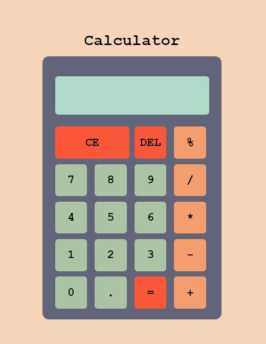

# the-basic-calculator
Modulo, addition, subtraction, multiplication, and division are among the primary functions of this calculator. Backspace and clearing the screen are also supported.

## try it yourself
### https://basic-cal.netlify.app/

## Snapshot
